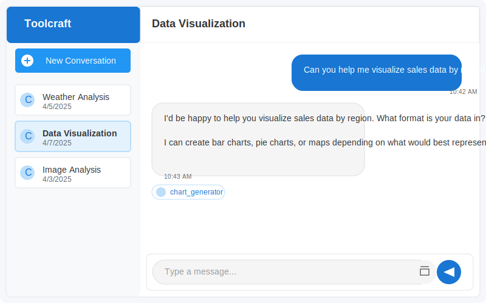
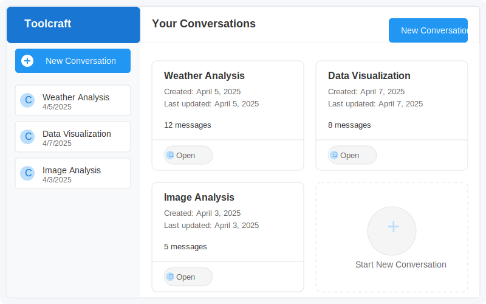

# Toolcraft: Multimodal AI Assistant

Toolcraft is an intelligent assistant that can see, think, and act. It processes multimodal inputs (text, images, files) and uses a range of tools to complete complex tasks.

## Features

- **Multimodal Understanding**: Process text, images, and files in a unified way
- **Intelligent Tool Selection**: Automatically choose the right tool for each task
- **Transparent Reasoning**: Show the step-by-step thinking process
- **Memory System**: Remember context from previous interactions
- **Extensible Tool System**: Easily add new capabilities

## Architecture

Toolcraft is built with a modular architecture:

- **Agent Service**: Core reasoning engine that orchestrates the workflow
- **LLM Service**: Interface to large language models
- **Vision Service**: Processes images and visual content
- **Memory Service**: Manages conversation history and context
- **Tool Registry**: Manages available tools and their capabilities

## Getting Started

### Prerequisites

- Node.js 18+
- Yarn package manager
- Docker and Docker Compose (for containerized deployment)
- OpenAI API key (for language and vision models)
- API keys for tools (Google Search, Weather API, etc.)

## User Interface

### Conversation View


The conversation interface allows direct interaction with the AI assistant, showing the agent's responses, reasoning process, and tool usage in real-time.

### Dashboard View


The dashboard provides an overview of all your conversations, making it easy to continue existing interactions or start new ones.

### Installation

1. Clone the repository:

```bash
git clone https://github.com/yourusername/toolcraft.git
cd toolcraft
```

2. Create environment configuration:

```bash
cp .env.example .env
# Edit .env with your API keys
```

3. Install dependencies:

```bash
yarn install
```

4. Start the development servers:

```bash
yarn dev
```

### Using Docker

You can also run the entire application using Docker Compose:

```bash
docker-compose up -d
```

## Available Tools

Toolcraft comes with several built-in tools:

- **Web Search**: Search the web for information
- **Weather**: Get current weather and forecast information
- **Calculator**: Perform mathematical calculations
- **Image Analyzer**: Extract information from images

## Adding New Tools

You can extend Toolcraft by creating new tools. Create a new class that implements the `Tool` interface:

```typescript
import { Tool } from '@toolcraft/shared';

export class MyCustomTool implements Tool {
  name: string;
  description: string;
  parameters: Record<string, any>;

  constructor() {
    this.name = 'my_custom_tool';
    this.description = 'Description of what your tool does';
    this.parameters = {
      param1: {
        type: 'string',
        description: 'Description of parameter 1',
        required: true
      },
      // Add more parameters as needed
    };
  }

  async execute(parameters: Record<string, any>): Promise<any> {
    // Implement your tool logic here
    // Process parameters and return results
  }
}
```

Then register your tool in the `app.ts` file:

```typescript
import { MyCustomTool } from './services/tools/implementations/MyCustomTool';

// ...

// Register your custom tool
toolRegistry.registerTool(new MyCustomTool());
```

## Project Structure

```
toolcraft/
├── packages/
│   ├── api/               # Backend API server
│   │   ├── src/
│   │   │   ├── routes/    # API routes
│   │   │   └── services/  # Business logic services
│   │   └── Dockerfile     # API Docker configuration
│   │
│   ├── web/               # Web client (React)
│   │   ├── src/
│   │   │   ├── components/
│   │   │   └── pages/
│   │   └── Dockerfile     # Web Docker configuration
│   │
│   ├── mobile/            # Mobile client (React Native)
│   │
│   └── shared/            # Shared code and types
│
├── docker-compose.yml     # Docker Compose configuration
└── .env.example           # Example environment variables
```

## API Documentation

### Agent Endpoints

- `POST /api/agent/process-text` - Process a text input
- `POST /api/agent/process-image` - Process an image input
- `POST /api/agent/process-file` - Process a file input
- `GET /api/agent/tools` - Get available tools

### Conversation Endpoints

- `POST /api/conversation` - Create a new conversation
- `GET /api/conversation/:id` - Get a conversation by ID
- `GET /api/conversation` - List conversations for a user
- `PUT /api/conversation/:id` - Update a conversation
- `DELETE /api/conversation/:id` - Delete a conversation
- `GET /api/conversation/:id/messages` - Get messages for a conversation
- `GET /api/conversation/:id/summary` - Get a summary of a conversation

### Tool Endpoints

- `GET /api/tool` - List all available tools
- `GET /api/tool/:name` - Get details for a specific tool
- `POST /api/tool/:name/execute` - Execute a tool directly
- `POST /api/tool/:name/validate` - Validate parameters for a tool

### User Endpoints

- `POST /api/user` - Create a new user
- `GET /api/user/:id` - Get user info
- `DELETE /api/user/:id/memory` - Clear all memory for a user
- `GET /api/user/:id/preferences` - Get user preferences
- `PUT /api/user/:id/preferences` - Update user preferences
