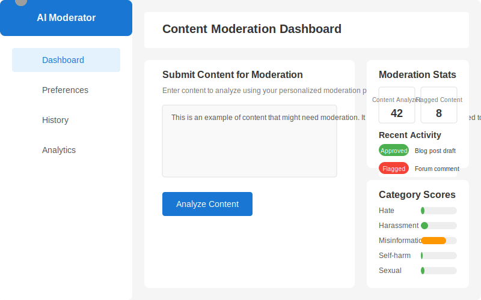
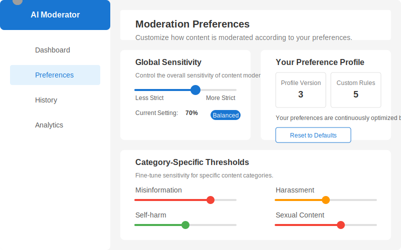

# Personalized AI Content Moderator

A sophisticated AI-powered content moderation system that learns individual and community preferences, provides explainable decisions, and adapts over time through user feedback.

# Dashboard


## Project Overview

This system addresses the challenge of content moderation by providing a personalized approach that respects different community standards and individual preferences. It leverages modern AI techniques to deliver moderation decisions that are explainable, consistent, and adaptable.

# Preference Section


## Getting Started

### Prerequisites

- Docker and Docker Compose
- OpenAI API key

### Installation

1. Clone the repository:
   ```bash
   git clone https://github.com/yourusername/ai-content-moderator.git
   cd ai-content-moderator
   ```

2. Create environment files:
   ```bash
   touch backend/.env
   ```

3. Update the `.env` file with your OpenAI API key and other configuration

4. Start the application with Docker Compose:
   ```bash
   docker-compose up -d
   ```

5. Access the application:
   - Frontend: http://localhost:3000
   - Backend API: http://localhost:8000
   - API Documentation: http://localhost:8000/docs
